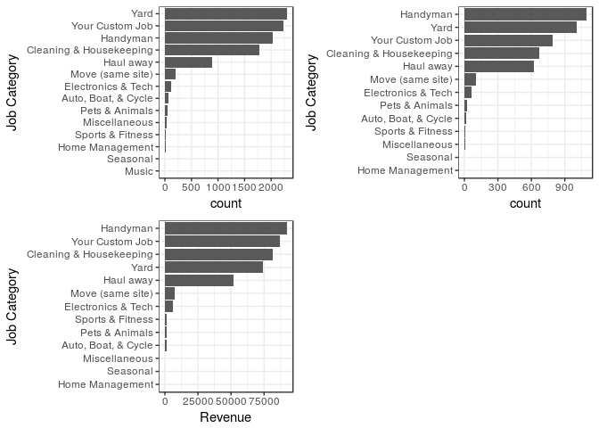
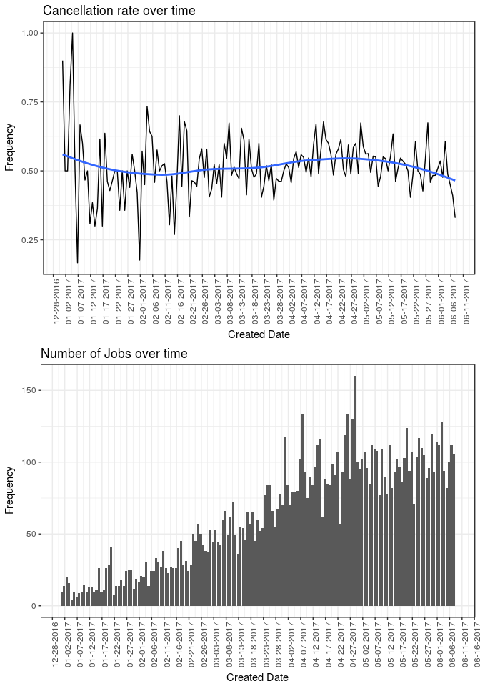

# Analysis on Takl's operation
Francis Ratsimbazafy  

## Data {.tabset}

Let us first have a look at what the data looks like, what columns are in each data

### Appointment

    Id  chore                                   category                  subcategory                                                                                                                                                         skill                     responses   yes.responses   notif   disputes   zipcode  preceding.appt   counterbid    original.price   accepted.price  discounts   schedule.time             status      token                                  arrival.time              enroute   completed.time            created.at      updated.at    
------  --------------------------------------  ------------------------  ------------------------------------------------------------------------------------------------------------------------------------------------------------------  -----------------------  ----------  --------------  ------  ---------  --------  ---------------  -----------  ---------------  ---------------  ----------  ------------------------  ----------  -------------------------------------  ------------------------  --------  ------------------------  --------------  --------------
  7020  Remove 1 shed - disposal fee applies*   Haul away                 Outdoor                                                                                                                                                             Remove metal/wood shed            2               2      NA         NA     37076  No               FALSE                     NA              150  NA          2017-02-07 14:00:00 UTC   canceled    d3285bbf-06fd-4dbf-ad15-5a031a217ea9   NA                        NA        NA                        1/31/17 20:14   2/8/17 21:56  
 20466  Perform an extra small chore            Your Custom Job           Choose this option when you have a job that is not on our list. Pick the size of your job, take a few photos, include instructions as a Note, and you're all set!   Custom Job                       14               1      NA         NA     37204  No               FALSE                     NA               50  NA          NA                        finalized   fcb1c07b-5d19-4492-b6ed-bdfc8e2ea946   2017-04-30 17:19:36 UTC   NA        2017-04-30 18:50:39 UTC   4/30/17 11:25   4/30/17 14:58 
 25379  Clean 1 bedroom apartment               Cleaning & Housekeeping   Clean Apartment                                                                                                                                                     Clean apartment                  26               3      NA         NA     29707  No               FALSE                     NA               70  6F294       2017-05-21 18:00:00 UTC   canceled    b5474e3c-b6f5-4f4e-83c0-2b3b7e07f808   NA                        NA        NA                        5/20/17 19:26   5/21/17 10:32 

There are 10.000 jobs in this data. Most of them are either finalized or cancelled. 5212 jobs were cancelled, which represent 52.12% of the data, and 4649 jobs were finalized. 

<!-- -->

### Zip data

   Id   zipcode  created.at                updated.at                provider.signup   lnglat                                          region  
-----  --------  ------------------------  ------------------------  ----------------  ----------------------------------------------  --------
 5085     30683  2017-03-15 15:44:03 UTC   2017-03-15 15:44:04 UTC   TRUE              POINT (-9268606.119911239 4020158.329738545)    Atlanta 
 5084     30677  2017-03-15 15:43:55 UTC   2017-03-15 15:43:56 UTC   TRUE              POINT (-9284079.339888368 3998822.9380719666)   Atlanta 
 5083     30671  2017-03-15 15:43:52 UTC   2017-03-15 15:43:52 UTC   TRUE              POINT (-9258442.049276562 3995282.329624237)    Atlanta 
 5082     30669  2017-03-15 15:43:45 UTC   2017-03-15 15:43:46 UTC   TRUE              POINT (-9245931.475095455 3984395.1457336657)   Atlanta 
 5081     30667  2017-03-15 15:43:37 UTC   2017-03-15 15:43:38 UTC   TRUE              POINT (-9260260.542214263 4003222.667037119)    Atlanta 
 5080     30662  2017-03-15 15:43:30 UTC   2017-03-15 15:43:31 UTC   TRUE              POINT (-9250710.966300715 4062155.8771902123)   Atlanta 

There are duplicated rows in the zip data. I removed all of them (some of them were duplicate in all respects, others are created at a later date and time, but essentially have the same zipcode, longlat, region).

## Most popular jobs by Region
At a first glance, yard job, custom job, handyman, cleaning and housekeeping, and haul away are the most demanded jobs at Takl. The first graph shows the most popular jobs irrespective of the status. The second figure is limited to jobs that are finalized. As we can see, these categories remain top 5, although the order is a litte bit altered, with handyman being the top demanded job, followed by yard, custom jobs, cleaning and housekeeping, and haul away. Finally, the second row shows the most profitable finalized jobs. Again, the previous categories remain top five, and handyman being the most lucrative category.
<!-- -->

The five most popular jobs identified earlier remain the most demanded jobs, even at a region level. As can be seen from the figure below, yard jobs, handyman, cleaning and housekeeping, haul away, and custom jobs are the top five most demanded jobs in all regions. The order varies by region, and in general, yard and handyman are the most popular. In the figure below, I restricted the data to finalized jobs only.
<!-- -->

## Duration of jobs, by region
The heatmap belows shows that on average, most finalized jobs are completed within five to ten hours.
<!-- -->

## Cancellation rate over time
<!-- -->

## Counter-bidding: positive or negative effect on cancellations?
<!-- -->

## What else?

